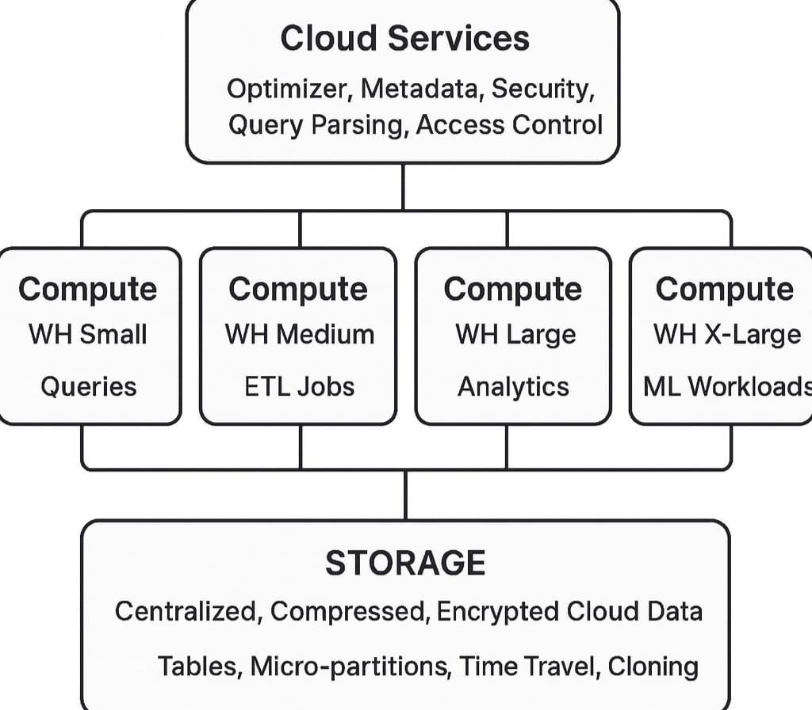

# Snowflake Architecture Made Simple  
*A modern story explaining Storage, Compute & Cloud Services*

Snowflake is often described as a *“cloud-native data warehouse”*, but that phrase barely scratches the surface.  
To truly understand Snowflake, imagine you are entering a **future city built only for data** — a place where:

- Data flows like water  
- Computation is summoned on demand  
- Security is the air the city breathes  
- Nothing ever breaks because everything is designed for the cloud  

This is not something traditional databases were built to do — *but Snowflake was*.

---

# 🏙 Snowflake Architecture at a Glance

```
```


```

````

This simple diagram tells the whole story:  
**Storage at the bottom. Compute clusters in the middle. Cloud Services on the top orchestrating everything.**

---

# 🏢 1. Storage Layer — *The Infinite Library of Data*

The first stop in our story-city is the **Storage District**, a massive digital library.

### 🔍 How Storage Works Behind the Scenes
Snowflake converts your data into:
- **Micro-partitions** (tiny blocks of columnar data)
- **Metadata-rich files**
- **Highly compressed storage format**
- **Automatic statistics collection**

This means you get:
- No indexing required  
- No vacuuming  
- No partitioning decisions  
- No storage tuning  

Snowflake handles EVERYTHING.

### 🛡 Storage Security Built-In
- End-to-end encryption  
- Data automatically encrypted at rest and in transit  
- Optional **Tri-Secret Secure** (Enterprise edition+)  

### 🏭 Real Example  
A logistics company streams billions of IoT device records daily.  
They simply **dump the data into Snowflake**:  
→ Snowflake organizes it  
→ Compresses it  
→ Optimizes it for future queries  

No DBA.  
No storage admin.  
No downtime.

---

# ⚙️ 2. Compute Layer — *The Virtual Warehouses Working Like Specialized Teams*

Next, we enter the **Compute Zone** — workers operating on demand.

Virtual Warehouses (often called **WH**) are:
- Independent compute clusters  
- Sized from X-Small to 6XL  
- Auto-suspend / auto-resume capable  
- Perfectly isolated from each other  

### 🧠 Why Compute Is Independent
Unlike traditional monolithic databases, Snowflake lets:
- Finance team use a small warehouse  
- Data engineering use a large one  
- BI dashboards run on another warehouse  

All three can query the **same data** without stepping on each other.

**That’s something Oracle, SQL Server, Redshift, or Postgres can’t do.**

### ⚡ Compute Scaling Options
Snowflake allows four types of scaling:

| Scaling Type | Purpose |
|-------------|---------|
| **Scale Up** | Increase warehouse size |
| **Scale Down** | Save cost when load is small |
| **Scale Out (Multi-cluster)** | Handle concurrency spikes |
| **Scale-In** | Reduce cluster count automatically |

This flexibility allows companies to handle:
- Morning dashboard rush  
- End-of-month finance processing  
- Heavy ETL during nights  
- ML workloads during weekends  

All without performance bottlenecks.

---

# ☁️ 3. Cloud Services Layer — *The Smart Brain in the Sky*

The top layer is the **Cloud Services Layer**, Snowflake’s brain.

### 🧩 What This Layer Manages
- Metadata & micro-partition details  
- Query parsing & optimization  
- Authentication & RBAC  
- Governance policies  
- Query execution plans  
- Caching  
- Warehouse coordination  

This layer knows:
- Where data lives  
- How to read it efficiently  
- How to secure it  
- Who can access what  
- What optimizations to apply  

### 🔍 Example  
You write a query like:

```sql
SELECT region, SUM(sales)
FROM SALES
GROUP BY region;
````

The Cloud Services Layer:

1. Reads metadata about the SALES table
2. Identifies relevant micro-partitions
3. Pushes work to the selected warehouse
4. Applies the best execution plan
5. Returns results using caching where possible

Result: **fast execution, minimal work from you.**

---

# 🔗 How the Three Layers Work Together (Real-life Analogy)

Imagine ordering a coffee from a smart café:

### Storage → The pantry

Where ingredients are stored neatly.

### Compute → The barista

Makes the coffee based on your order.

### Cloud Services → The cashier + manager

Understands your order, checks your permissions (😄), optimizes workflow.

This trio working together forms the magical simplicity of Snowflake.

---

# 🎯 Benefits of Snowflake Architecture 

### 1. **Separation of Storage and Compute**

Scale each independently → Save cost + improve speed.

### 2. **Performance Isolation**

Different teams use different warehouses → No contention.

### 3. **Elastic Scaling**

Warehouses auto-start, auto-stop, scale up/down, and scale out.

### 4. **Zero Maintenance**

No hardware
No indexing
No vacuuming
No tuning

### 5. **Security Built-In**

Encryption, RBAC, network policies, masking, governance.

### 6. **Multi-Cloud**

Supports AWS, Azure, and GCP with the same architecture.

---

# 🧱 Architecture Summary in One Sentence

**Snowflake’s architecture separates storage, compute, and services, enabling near-infinite scalability, fast performance, and painless maintenance — something traditional databases could never achieve.**

---

# 🚀 Up Next

👉 Continue learning with **Virtual Warehouses — What They Are & How They Work**

